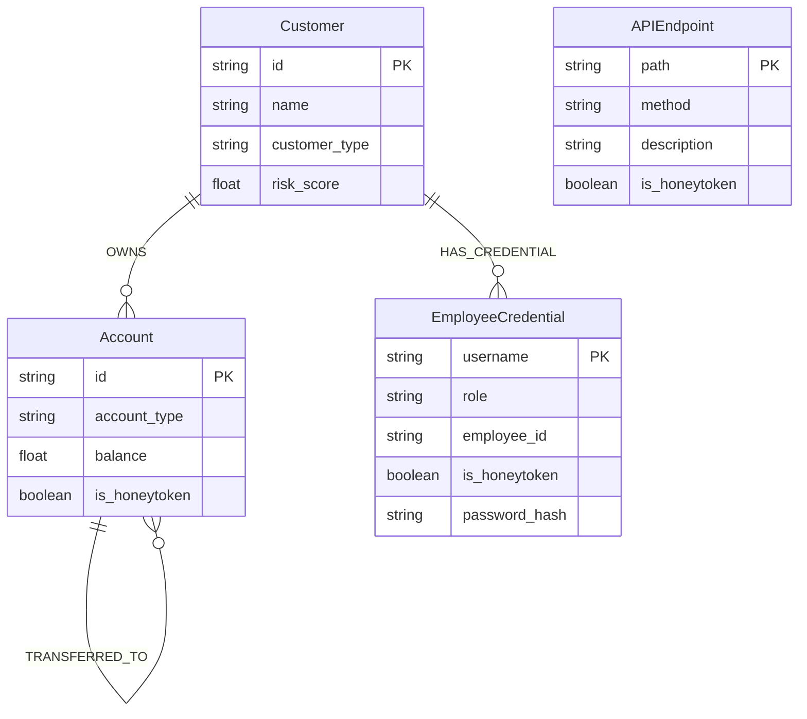

# NyxVault Lite - System Architecture Documentation

This document describes the design, components, and schema for **NyxVault Lite: Adaptive AI Deception System for Banking Threat Detection**.

## 1. System Architecture Diagram

Below is the interaction flow between the Frontend, Backend, Neo4j Graph Database, and the three logic engines (Simulator, Detector, Mutator).

```mermaid
graph TD
    subgraph Frontend (React Dashboard)
        UI[Interactive UI]
        Cyto[Cytoscape.js Graph Canvas]
        WS_Client[WebSocket Client]
    end

    subgraph Backend (FastAPI Service)
        API[FastAPI Routers]
        WS_Server[WebSocket Server]
        Bus[Event Bus Manager]
        
        subgraph Logic Engines
            Sim[Attack Simulator]
            Det[Threat Detection Engine]
            Mut[Adaptive Mutation Engine]
        end
        
        Client[Neo4j Client]
    end

    subgraph Database Layer
        Neo[(Neo4j Graph DB)]
    end

    %% Interactions
    UI -->|REST requests| API
    Cyto -->|Fetch nodes/edges| API
    API -->|Cypher queries| Client
    Client -->|Graph operations| Neo
    
    %% Engine loops
    Sim -->|Generates activities| Det
    Sim -->|Updates balances/logs| Client
    Mut -->|Adapts deception paths| Client
    Mut -->|Broadcasts mutations| Bus
    
    Det -->|Flags honeytoken access & anomalies| Bus
    Det -->|Writes Alerts| Client
    
    %% Websockets
    Bus -->|Real-time stream| WS_Server
    WS_Server -->|WS Connection| WS_Client
    WS_Client -->|Live Feed / Trigger UI refresh| UI
```

---

## 2. Neo4j Graph Database Schema

NyxVault Lite relies on graph relations to represent accounts, customers, API endpoints, and credentials. Some nodes/relations are tagged as cognitive honeytokens to trap threat actors.



### Constraints & Indexes
- Unique constraint on `Customer.id`.
- Unique constraint on `Account.id`.
- Unique constraint on `APIEndpoint.path`.
- Unique constraint on `EmployeeCredential.username`.

---

## 3. Data Processing and Anomaly Detection Engine

The system uses a hybrid rule-based and machine-learning threat detection model:

```mermaid
stateDiagram-v2
    [*] --> EventCaptured
    EventCaptured --> HoneytokenCheck : Assess is_honeytoken flag
    
    state HoneytokenCheck {
        --> HoneytokenTrue : is_honeytoken == True
        --> HoneytokenFalse : is_honeytoken == False
    }

    HoneytokenTrue --> InstantAlert : Rule-Based Bypass
    InstantAlert --> SecurityAlert : Risk Score = 90-100, Confidence = 1.0
    
    HoneytokenFalse --> FeatureExtraction : Build ML Input Vector
    FeatureExtraction --> IsolationForest : [Frequency, Transaction Amount Ratio, Unauthorized Role]
    
    IsolationForest --> NormalActivity : ML Prediction == 1 (Normal)
    IsolationForest --> AnomalousActivity : ML Prediction == -1 (Anomaly)
    
    NormalActivity --> LogEvent : Risk Score < 50
    AnomalousActivity --> SecurityAlert : Risk Score > 60
    
    SecurityAlert --> WebSocketBroadcast : Send to UI
    LogEvent --> WebSocketBroadcast
    WebSocketBroadcast --> [*]
```

---

## 4. REST & WebSocket API Documentation

### HTTP Endpoints

| Method | Endpoint | Description | Response Model |
| :--- | :--- | :--- | :--- |
| **GET** | `/` | Service health status | JSON |
| **GET** | `/api/v1/stats` | Retrieve aggregate counts (Customers, Accounts, Transactions, Alerts, Mutations) | `SystemStats` |
| **GET** | `/api/v1/graph` | Fetch graph data in Cytoscape format | `CytoscapeGraph` |
| **POST** | `/api/v1/simulation/start` | Resume the automatic Attack Simulator background task | `SimulationStatusResponse` |
| **POST** | `/api/v1/simulation/stop` | Pause the automatic Attack Simulator background task | `SimulationStatusResponse` |
| **POST** | `/api/v1/simulation/trigger` | Queue a specific mock cyberattack immediately | JSON |
| **POST** | `/api/v1/mutation/start` | Resume the Adaptive Mutation Engine background task | `MutationStatusResponse` |
| **POST** | `/api/v1/mutation/stop` | Pause the Adaptive Mutation Engine background task | `MutationStatusResponse` |
| **POST** | `/api/v1/mutation/trigger` | Trigger a deception mutation cycle immediately | JSON |

### Honeytoken Trap Endpoints
Accessing these routes returns a dummy success response, but immediately routes an alert to the detection engine:
- **POST** `/api/v1/internal-premium-transfer-api`
- **GET** `/api/v1/admin-liquidity-dashboard`
- **POST** `/api/v1/internal-settlement-engine`

### WebSocket Streaming
- **WS Connection**: `/ws/events`
- **Payload Format**: `SecurityEvent` JSON schema containing event type, risk scores, confidence values, source IP, and transaction detail logs.
